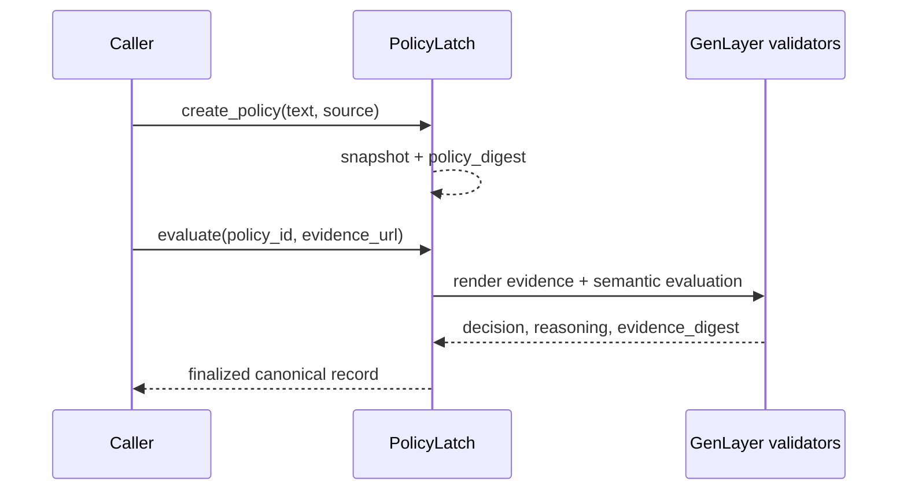

# PolicyLatch

> A reusable GenLayer Intelligent Contract primitive for policy-bound semantic decisions.

[](https://genlayer-explorer.vercel.app/address/0x39550E512759E0aE9C5f4fbfF500BE1678afBF4C) [](contracts/policy_latch.py) [](LICENSE)

## Intelligent Contract

PolicyLatch is a reusable GenLayer primitive that snapshots a policy and turns independently fetched evidence into a consensus-backed `PASS`, `FAIL`, or `INDETERMINATE` decision. Validators compare the complete typed result and the SHA-256 digest of the evidence they independently fetched.

## Protocol map



## Design guarantees

| Guarantee | Enforced by |
| --- | --- |
| Policy cannot silently change | Snapshot and SHA-256 digest at creation |
| Evidence drift is visible | Independent fetch and digest equality |
| Malformed model output fails closed | Exact result schema validation |
| Final state is not replayed | `ACCEPTED` policies reject another evaluation |

Deployed on StudioNet: [`0x39550E512759E0aE9C5f4fbfF500BE1678afBF4C`](https://genlayer-explorer.vercel.app/address/0x39550E512759E0aE9C5f4fbfF500BE1678afBF4C). Transaction: [`0x68e14a6928fede00aacb5f35110057e55aad07c15f9997543a1ff2fd45dfaad8`](https://genlayer-explorer.vercel.app/tx/0x68e14a6928fede00aacb5f35110057e55aad07c15f9997543a1ff2fd45dfaad8).

### Why GenLayer

`gl.nondet.web.render` and `gl.nondet.exec_prompt` handle evidence retrieval and semantic evaluation. `gl.vm.run_nondet_unsafe` rejects divergent decisions, reasoning, and evidence digests before state is finalized. Deterministic code owns policy snapshotting, schema validation, and one-time finalization.

### Public API

- `create_policy(policy_id, policy_text, source_url)` snapshots policy content and its digest.
- `evaluate(policy_id, evidence_url)` runs validator consensus and stores the final decision.
- `get_policy(policy_id)` returns the canonical record.
- `list_policy_ids()` lists registered policies.

### Verification

```bash
python -m py_compile contracts/policy_latch.py
```

See [architecture](docs/ARCHITECTURE.md) and [threat model](docs/THREAT_MODEL.md) for the security model and reviewer checklist.

This repository is an Intelligent Contract primitive, not medical, legal, financial, or safety advice.
